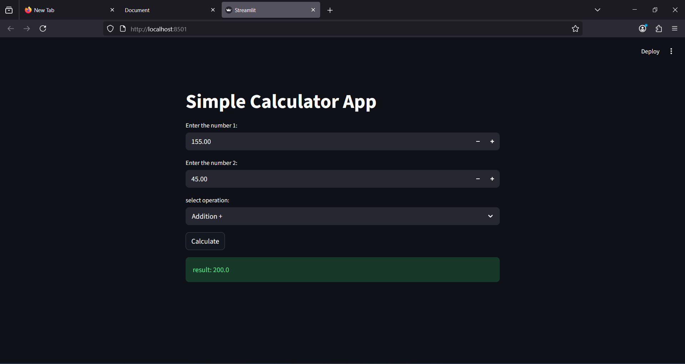

# 🧮 Simple Calculator (Streamlit)

A basic calculator built using Streamlit.

## Features
- Addition
- Subtraction
- Multiplication
- Division
- Modulo

## Tech Stack
- Python
- Streamlit

## Run
streamlit run app.py

