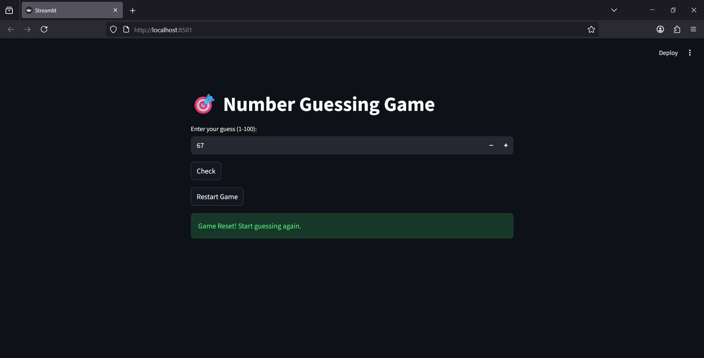

🎯 Number Guessing Game (Streamlit)

A simple and interactive number guessing game built using Streamlit and Python.

🚀 Features
Random number generated between 1 and 100
User inputs guesses through UI
Instant feedback:
🔼 Too High
🔽 Too Low
✅ Correct Guess
Tracks number of attempts
Restart game option

🛠️ Tech Stack
Python 🐍
Streamlit 📊
Random module 🎲

🎮 How to Play
Enter a number between 1 and 100
Click Check
Follow hints:
"Too high" → decrease your guess
"Too low" → increase your guess
Guess correctly to win 🎉
🔄 Restart Game

Click on Restart Game button to play again.

