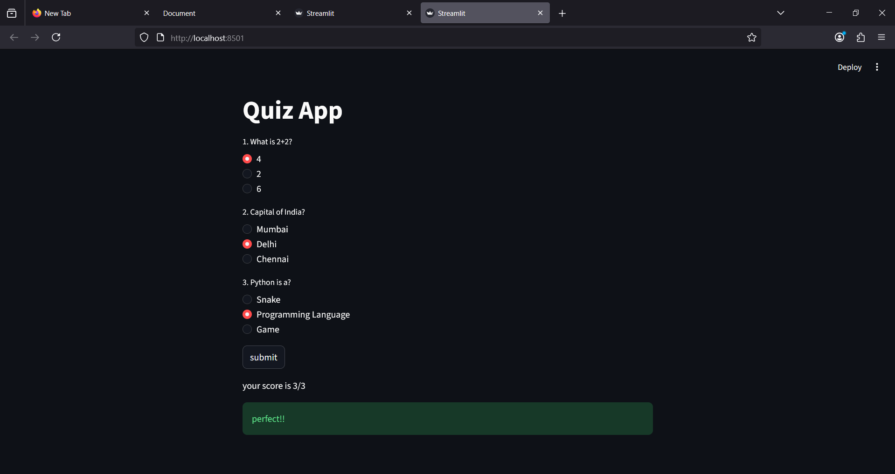

Simple Quiz App (Streamlit)

A basic quiz application built using Streamlit.
Users can answer multiple-choice questions and view their final score.

🚀 Features
📋 Multiple-choice questions
✅ Select answers using radio buttons
🎯 Score calculation
🧾 Final result display

🛠️ Tech Stack
Python
Streamlit
📸 Preview

⚙️ How to Run
Install dependencies:
pip install -r requirements.txt
Run the app:
streamlit run app.py